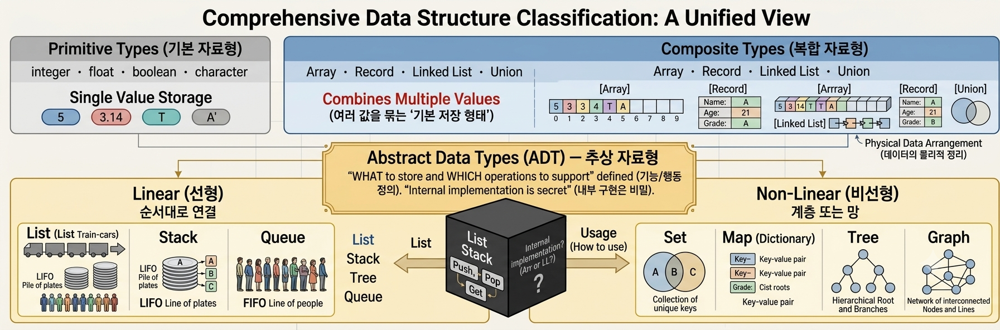
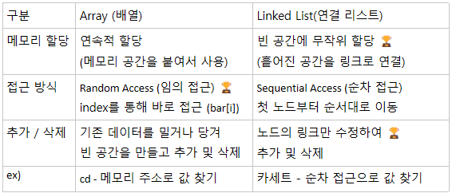
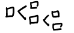

# Data Structure

```text
Data를 효율적으로 저장, 관리, 접근 하기 위해 정의된 형태, 방법

자료구조 선택에 따라 코드 길이, 실행 속도, 가독성이 달라짐
유지 보수에 용이함

✔️자료 구조의 표준 분류 (자료 구조론)
```

```text
Composite Types (복합 자료형)
```

```text
Array의 단점 보완 (os, 하드웨어로 해결)
    - 메모리 할당
        ○ 가상 메모리 생성 후 값 할당 
    - 추가 및 삭제
추가 및 삭제 할 값의 양 옆 데이터를 하나의 Memory Copy(메모리 덩어리)로 묶어서 사용
```
```text
ADT (추상 자료형)
    - Linear (선형)
```

```text
    1 : 1 연결 상태
    순서가 있어서 순회 가능
```
```text
    - Non - Linear (비선형)
```


```text    
    1 : n , n : n 연결 상태
순서 ❌ -> 원칙적 순회 ❌
```
```text
Collection (컬렉션)
각 프로그래밍 언어가 자체적으로 구현하여 제공하는 표준 라이브러리

python
list, tuple, dict, set, str
```
