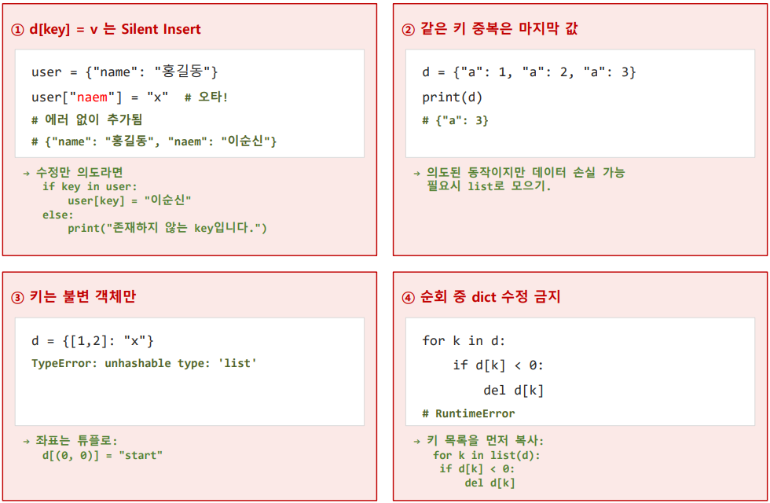

# Dictionary
```text
- Dictionary
1) Key - Value (키 -  값)
    ○ 사전처럼 키 - 값 형식
2) Key는 고유 값 (중복 X) 
    ○ 같은 Key에 다시 대입하면 덮어쓰기
3) Key으로 빠른 접근
    ○ Hash table로 인한 빠른 검색 가능
4) Key는 불변 타입만 가능
    ○ 불변 -> Hash 가능 -> Key (Str, num, Tuple 가능)
5) 순서 보장 (Python 3.7 +)
    ○ non - linear는 원칙적 순서 ❌ 
    Python 3.7 이상부터 가능해짐
6) Mutable (가변)
    ○ Key, Value을 추가, 삭제, 수정 가능

✔️초기화
    1) 기본 생성
    bar = {key : value} 
    2) 빈 딕셔너리
    bar = {}
    bar = dict()
    3) dict() 키워드 인자
    bar = dict(key=value
    4) comprehension (컴프리헨션)
    
✔️Create
    1) 새 key 추가
    d[key] = value
    2) 카운트 패턴
    count = {} 
    count["a"] = count.get("a", 0) + 1
    # key "a"값이 있으면 +1 없으면 0 반환 후 +1
    3) update() (여러 key - value 추가)
    d.update({key: value, key, value})
    4) setdefault() (없을 때만 추가)
    d.setdefault(key, value)
    ⚠️ 해당 key가 없을 때 추가 / key가 있을 땐 기존 값 반환
    
⚠️ d[key] = value은 키가 없어도 새키로 추가됨
    -> 오타로 의도치 않은 키 생성 가능성 우려
    ✅ 수정이 의도라면 if 절로 확인 후 처리
        if key in d:
            d[key] = value 
            
✔️Read
    1) [] 기본
    d[key] 
    ⚠️ key 값이 없을 경우 -> keyError
    2) get() / 권장
    d.get(key) -> vaule
    d.get(없는 key) -> None 반환
    d.get(없는 key, value) -> value 반환
    3) key 존재 여부 검사
    key in dict
    4) 키, 값, 키 -  값 조회
    d.keys() # 생략 가능 
    d.values() 
    d.items() # 키 - 값 조회
    
✅ key 값 존재 여부 확실치 않을 경우 
    d.get() or if key in dict로 확인
    
✔️Update
    1) 새 값 수정 (덮어쓰기)
    d[key] = value
    2) 카운트 증가
    d[key] = count.get(key, 0) + 1
    3) update() (여러 값 수정)
    d.update({key: value, key, value})
    ✅ 여러 키를 한번에 덮어쓰기 / 새 키와 함께 추가 가능
    ⚠️ setdefault는 update ❌ -> 수정이 아닌 기존 값 반환
    
✅ key ❌ -> Create
     key ⭕ -> Update
     key 🤷‍♂️ -> if key in d로 존재 여부 확인 후 사용


✔️Delete
    1) key로 삭제
    del d[key] ⚠️key 없으면 -> keyError
    2) 삭제 및 반환
    bar = d.pop(key) ⚠️key 없으면 -> keyError
    bar = d.pop(key, default) ✅key없으면 default 값 반환 -> 안전
    3) 삭제 및 마지막 쌍 반환
    bar = d.popitem()
    4) 전체 비우기
    d.clear()
    
    
    


✔️interation (순회)
    1) key
    for k in dict / for k in dict.keys()
    2) value
    for v in dict.values()
    3) items() 패턴 🌟tuple unpacking
    for k, v in dict.items()
    
✔️응용
    1) 평균 계산
    avg = sum(dict.values()) / len(dict)
    
    
    2) Comprehension (컴프리헨션)
d = {key: value for key, value in dict.items()}

⚠️ 주의사항
```
