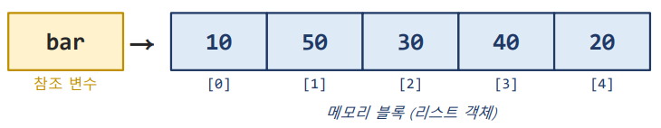
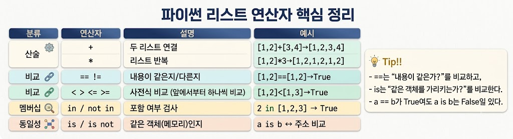
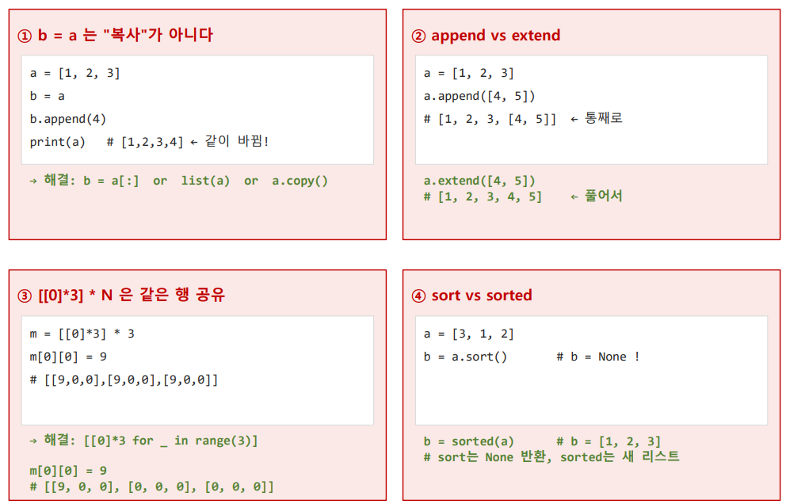

# List
```text
    1) Ordered ( 순서 유지)
        ○ 입력된 순서 유지 / index로 접근
    2) Mutable (가변)
        ○ 실행 중 요소를 추가, 삭제 , 변경 가능
    3) 중복 허용
    4) 이질적 자료형 허용
        ○ 정수, 문자열, 실수, 다른 리스트까지 한 개의 리스트에 섞어 담을 수 있음

Reference Variable (참조 변수) : 메모리 주소를 저장하는 변수 (리스트 객체를 가르키는 이름표)
```

```text
✔️초기화
        1) 리터럴 방식 
            bar = [ 요소 ]
        2) 빈 리스트
            § bar = []
            § bar = list()
        3) list() 변환
            bar = list(요소) / list(range(n)
        
✔️Create
        1) append() (한 개 추가)
            bar.append(요소)
        2) extend() (여러 개 추가)
            bar.extend(요소)
        3) + 합치기 (기존 리스트 유지, 새 리스트 생성)
            new_bar = bar + [요소] # 새 리스트
        4) insert() (원하는 위치에 값 추가)
            bar.insert(위치, 값)
            뒤 요소는 한 칸씩 뒤로 밀림
        
        
✔️Read
        1) indexing (인덱싱)
        
        bar[i]
        2) slicing (슬라이싱) slicing 페이지 참고
            ⚠️ 슬라이싱의 결과는 새 리스트
    
✔️Update
        1) index 직접 변경
            bar[i] = 값
        2) slice 대입
            bar[0:2] = 값
        3) 메서드 수정
            § bar.sort() # 오름차순 정렬
            § bar.sort(reverse=True ) # 내림차순 정렬
            § bar.revese() # 순서 뒤집기
            § new_bar = sorted(bar) # 오름차순 정렬 새 리스트 반환 / 기존 리스트 유지
            
✔️Delete
        1) index로 삭제
            del bar[i]
        2) 입력한 값 삭제
            bar.remove(값)
        3) index의 값을 꺼내고 삭제 및 반환
            bar.pop(i= -1)
        4) 전체 비우기
            bar.clear()

✔️ 연산자
```

```text
✔️ 주요 메서드 및 내장 함수
매서드 (원본 변경) — 리스트 자체가 수정됨a = [3, 1, 4, 1, 5, 9, 2, 6]
    -   추가
        a.append(7) 맨 뒤에 7 추가
        a.extend([8, 9]) 맨 뒤에 여러 값([8, 9]) 연결
        a.insert(1, 99) 1번 인덱스 위치에 99 삽입

    -   탐색
        a.index(4) 값 4가 있는 위치(인덱스) 
        
    -   반환 
        a.count(1) 값 1의 개수 세기

    -   정렬 
        a.sort() 오름차순 정렬
        a.sort(reverse=True) 내림차순 정렬
        a.reverse() 현재 순서를 반대로 뒤집음


2. 내장 함수 (원본 유지) 원본은 그대로 두고 새 결과 반환 b = [3, 1, 4, 1, 5]
    -   새 리스트 반환
        sorted(b) 정렬된 새 리스트 반환 (b는 그대로)
        list(reversed(b)) 순서가 뒤집힌 새 리스트 반환 ([5, 1, 4, 1, 3])
        
    -   집계 (단일 값 반환)
        len(b) 전체 요소 개수 (5)
        sum(b) 전체 요소의 합 (14)
        max(b) 최댓값 (5)
        min(b) 최솟값 (1)
```
