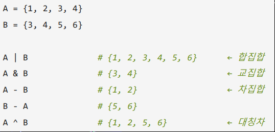

# Set
```text
- Set
1) 중복 자동 제거
2) Unordered (순서 ❌)
    • indexing ❌, 순서 보장 ❌
3) Mutable (가변)
    • 추가, 삭제 가능 ⚠️ hash 가능한 값만 가능
4) 빠른 속도의 포함 검사
5) 집합 연산 
    • 합집합, 교집합, 차집합, 대칭차집합
6) frozenset (불변 집합)
    • 변경 불가, dict key or 다른 set 원소 

✔️ 초기화
    1) {} 
    bar = {1, 2, 3}
    2) set() 함수
    bar = set()
    ⚠️ word = set("hello") -> 중복 L 제거 / 순서 보장 ❌
    3) comprehension (컴프리헨션)
    bar = {v for v in 반복 가능 객체}
    4) set() (빈 집합)
    

⚠️ 원소는 hash 가능 요소만 가능
        ○ 담을 수 있는 값 = 바뀌지 않는 값

        
✔️ Create
    1) add() (한 개 추가)
    s.add(value) ⚠️ 이미 있으면 무시 -> 중복 ❌
    2) update() (여러 원소 추가)
    s.update(values) / s.update(반복가능 객체)
⚠️ 원소는 불변 타입


✔️ Read
⚠️ indexing ❌ -> Type Error
    1) 포함 검사
    value in set
    ✅ 매우 빠른 속도로 가능
    2) len(set) (길이)
    3) interation (순회)
    for v in set:
    ⚠️순서 보장 ❌
    4) 부분 집합 (A ⊆ B)
        ○ 집합 A의 모든 원소가 B집합에 속한 경우
        value <= set -> True 
    5) 상위 집합 (A ⊇ B)
        ○ 집합 A가 집합 B의 모든 원소를 포함 하는 경우
        set_1 >= set_2
    
    
    
✔️Update ❌

✔️Delete

    1) remove()
    s.remove(value) ⚠️value 없으면 -> Key Error
    2) discard()
    s.discard(value) ✅ Error ❌
    3) 임의 원소 삭제 및 반환 
    s.pop() ⚠️value 없으면 -> Key Error / (빈 집합)
    4) 전체 비우기
    s.clear()
    
    
✔️집합 연산
```


```text
✔️ 활용 & 실무
    1) 리스트 중복 제거
    bar = list(set([list]) ⚠️ 순서 보장 ❌ -> sorted(bar)를 통해 정렬
    2) 두 집합의 공통 (교집합)
    result = bar & foo
    3) 빠른 포함 검사
    value in set
```