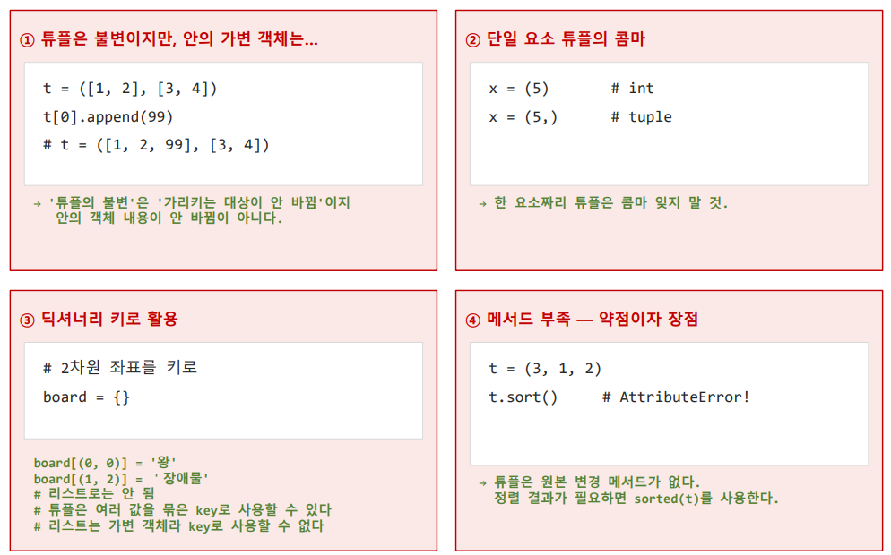

# Tuple
```text
    1) Ordered ( 순서 유지)
        ○ 입력된 순서 유지 / index로 접근
    2) Immutable (불변)
        ○ 요소의 변경, 추가, 삭제 불가 / 실수로 값이 바뀌는 것을 방지
    3) 중복 허용
    4) 딕셔너리의 키로 사용 가능
        ○ 불변 -> Hash 가능 (Hash 설명은 딕셔너리 참조)
    5) 함수의 "다중 반환"에 사용
        ○ return x, y → 실제로는 튜플 (x, y) 반환


✔️초기화
    1) 기본 생성
    bar = (요소,)
    bar = 요소,
    2) 빈 튜플
        § bar = ()
        § bar = tuple()
    3) 변환
    bar = tuple(요소)
    
⚠️ 튜플은 괄호가 아닌 콤마로 만들어진다
    (5)는 정수 . (5,)가 튜플


✔️Read
(List와 동일)
    1) indexing(인덱싱)
    2) slicing(슬라이싱)
    
⚠️Create, Update, Delete ❌
        § create 시도 -> AttributeError
        § update 시도 -> TypeError
        § Delete 시도 -> TypeError
✔️매서드
    1) count()
    2) index()


🌟기본 List, 값이 변해선 안될 때 Tuple
```
⚠️ 주의사항

```text
✔️ 수정은 새 Tuple 생성으로
        § 요소를 직접 수정 ❌
    -> 새 Tuple 생성
    
        기존 튜플을 수정한 것이 아닌 새 튜플을 만들어 다시 담은 것, (덮어쓰기)
✅ 불변의 자료는 이렇게 수정을 표현
```